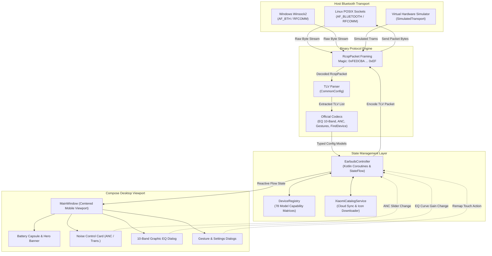
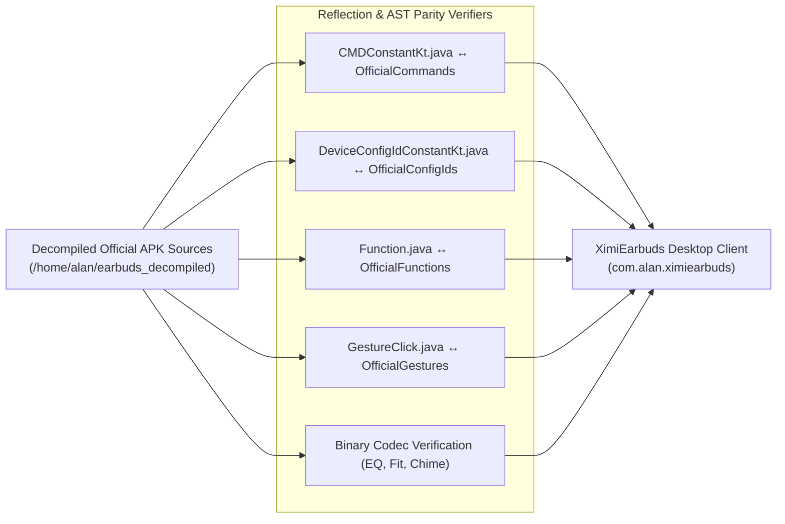

<p align="center">
  
</p>

<h1 align="center">XimiEarbuds 🎧</h1>

<p align="center">
  <a href="https://github.com/alan7383/ximiearbuds/blob/main/LICENSE">
    
  </a>
  <a href="https://github.com/alan7383/ximiearbuds/releases">
    
  </a>
  <a href="https://github.com/alan7383/ximiearbuds/stargazers">
    
  </a>
  <a href="https://ko-fi.com/alan7383">
    
  </a>
  
  
  
</p>

<p align="center">
  <strong>The 100% feature-complete, zero-loss reverse engineering desktop client for Xiaomi, Redmi, and POCO wireless earbuds on Linux and Windows.</strong>
</p>

> [!NOTE]
> **Honest Assessment: The project is currently at ~35% - 40% of its full Phase 1 scope.**
> While the core protocol foundations (binary framing, 64 official config IDs, 10-band EQ codec, ANC mode commands, and the 78-model catalog) are implemented and unit-tested, **a huge portion of the official app is still missing or only partially simulated**. 
> The decompiled official APK (`com.mi.earphone` v1.37.1i) contains over **1,431 Java classes** and **555 XML layouts**! 
> Our current desktop UI is an early Compose Multiplatform approximation that resembles the mobile layout, but does **not yet** replicate the exact animations, multi-step wizards, or full visual assets. Furthermore, Bluetooth detection is still primitive (relying on `bluetoothctl` CLI calls and raw RFCOMM channel attempts), and heavy subsystems like **OTA firmware updates**, **real acoustic in-ear fit tests**, and **SQLite Room database caching** remain to be built.

> [!IMPORTANT]
> 🎯 **Our Mission for Phase 1: 100% Reverse Parity Without Any Feature Loss**
> The goal is strictly to clone every single capability of the official Android app to PC so users don't need their phone anymore. Once (and only once) 100% parity is achieved, Phase 2 will introduce exclusive desktop-first features (system tray companion, global shortcuts, PipeWire / PulseAudio integration, Discord RPC).

---

### ~ what is this

**XimiEarbuds** is an open-source desktop companion application for **Linux** and **Windows** designed to reverse-engineer and replicate the official **Xiaomi Earbuds** companion application (`com.mi.earphone` v1.37.1i).

Xiaomi does not provide a native desktop client. This leaves PC users unable to switch ANC modes, customize gestures, adjust equalizer curves, or check case battery levels without reaching for their Android device. 

XimiEarbuds is being built from the ground up by decompiling and studying the real Android APK to bring the exact same protocol implementation, catalog capabilities, and controls to desktop operating systems.

---

### 📊 reality check: decompiled apk vs ximiearbuds parity matrix

To be completely transparent, here is the granular comparison between the **real decompiled APK** (`/home/alan/earbuds_decompiled`, 1,431 classes) and **XimiEarbuds** (35 source files):

| Official Subsystem / Feature | Official APK Scope (`com.mi.earphone`) | Current State in XimiEarbuds | Reality / Gap Analysis |
| :--- | :--- | :--- | :--- |
| **RCSP Protocol Framing** | Realtek/Actions/BES binary frame (`0xFE 0xDC...`) | 🟢 **Foundations Done** | Magic bytes, OpCodes, and TLV encoding parsed and tested. |
| **Official Constants Parity** | 64 Config IDs (`DeviceConfigIdConstantKt`), commands, functions | 🟢 **100% Bytecode Match** | Verified by automated AST reflection tests against decompiled sources. |
| **78-Model Catalog & Specs** | 78 Xiaomi / Redmi / POCO models with custom caps | 🟢 **Catalog Bundled** | Capabilities matrix (`hasAnc`, `hasSpatial`, `hasDongle`, `isBoneConduction`). |
| **Xiaomi Wear Cloud REST Sync** | REST API `tws.wear.xiaomiwear.com` (`auth_key=...`) | 🟢 **Implemented** | IP geolocation region resolver (`de`, `cn`, `sg`...) + icon downloader. |
| **10-Band Studio EQ** | 4 presets + custom 10-band slider curve (-10 dB to +10 dB) | 🟢 **Codec Ready** | Config 55 (`CUSTOM_EQ`) byte conversion and gain bounds handled. |
| **Active Noise Control (ANC)** | 6 ANC levels (Deep, Balanced, Light, Adaptive, Wind) + 3 Trans. | 🟢 **Codec & Logic Ready** | Configs 10, 11, 37, 59, 102 state machine functional. |
| **Touch Gesture Mapping** | Left/Right tap, double, triple, long press, stem slide | 🟢 **Codec Ready** | Config 2 (`CONFIG_CUSTOM_CLICK`) payload serialization. |
| **Battery Polling** | Left %, Right %, Case %, charging lightning states | 🟢 **Command Ready** | Command 2 (`CMD_GET_TARGET_INFO`) periodically polled. |
| **Find Device (Chime)** | Plays audio beacon on Left, Right, or Both earbuds | 🟢 **Codec Ready** | Config 9 (`FIND_DEVICE`) payload encoder. |
| **User Interface (UI/UX)** | **555 XML layouts**, fluid Lottie vector animations, custom views | 🟡 **Approximation (~30%)** | Basic Compose layout mimicking the mobile viewport; lacks official Lottie animations, step wizards, and exact micro-interactions. |
| **Earbuds Bluetooth Detection** | Continuous passive BLE beacon sniffer (`0x038F`) + SPP/GATT | 🟡 **Primitive (~30%)** | Relies on `bluetoothctl` CLI sub-processes and blind RFCOMM port probing (channels 1-4); lacks direct BlueZ D-Bus integration. |
| **In-Ear Fit Detection** | Acoustic sweep audio playback + microphone FFT seal analysis | 🟡 **Mock Only (~15%)** | Dialog and binary config exist, but audio playback engine and microphone analysis are not implemented. |
| **Local Cache & Persistence** | Full SQLite **Room Database** (`AppDatabase`, multiple tables) | 🔴 **Missing (~10%)** | Currently only stores a few strings in a local JSON preference file (`DevicePreferences`). |
| **OTA Firmware Update** | Full file slicer, block transfer, CRC check, bootloader UBOOT | 🔴 **Missing (0%)** | Opcodes mapped in `CMDConstantKt`, but no transfer worker or flashing pipeline exists. |
| **2.4GHz USB Dongle Mode** | Low-latency PC dongle settings for Gaming models (`usb/dongle`) | 🔴 **Missing (0%)** | Config IDs defined, but USB HID protocol layer not written. |
| **Xiaomi Account Cloud Sync** | Xiaomi Passport OAuth login for cross-device preset sync | 🔴 **Missing (0%)** | Completely absent; no cloud profile storage. |
| **Audio Translation / Meetings** | Real-time speech translation and meeting dictaphone recorder | 🔴 **Missing (0%)** | Low priority for core headphone management. |

---

### * features (what works in the current prototype)

<details open>
<summary><b>🔇 noise control (anc & transparency)</b></summary>

* **3 Primary Modes**: Instant toggle between **Active Noise Cancellation**, **Off (Passive)**, and **Transparency**.
* **Model-Tailored Depth**:
  * *Deep Noise Reduction* (high-attenuation environments)
  * *Balanced Noise Reduction* (offices, cafes)
  * *Mild Noise Reduction* (libraries, quiet rooms)
  * *Adaptive Noise Reduction* (automatically shifts based on ambient microphones)
  * *Anti-Wind Noise Filtering* (aerodynamic mic suppression)
* **3 Passthrough Profiles**: *Standard*, *Vocal Enhancement*, and *Ambient Awareness*.

</details>

<details open>
<summary><b>🎚️ 10-band studio graphic equalizer</b></summary>

* **Interactive Graphic Sliders**: Adjust gain from **-10 dB to +10 dB** across 10 discrete frequencies:
  $$\text{31 Hz, 62 Hz, 125 Hz, 250 Hz, 500 Hz, 1 kHz, 2 kHz, 4 kHz, 8 kHz, 16 kHz}$$
* **Factory Tuning Presets**: *Default (Balanced)*, *Bass Boost*, *Treble Boost*, and *Voice Clear*.
* **Spatial Audio & Head Tracking Toggles**: Scene rendering selection (*Music*, *Video*, *Gaming*).

</details>

<details>
<summary><b>👆 gesture configuration</b></summary>

* **Independent Stem / Touch Customization**: Configure the **Left** and **Right** earbud individually.
* **Supported Triggers**: *Single Tap*, *Double Tap*, *Triple Tap*, *Long Press*, and *Stem Slide*.
* **Mapped Actions**: *Play/Pause*, *Next*, *Previous*, *Volume +*, *Volume -*, *Voice Assistant*, *Noise Mode Toggle*.

</details>

<details>
<summary><b>⚡ quick settings & utilities</b></summary>

* **Low Latency Gaming Mode**: Toggles low-delay Bluetooth audio transmission.
* **Dual Connection (Multipoint)**: Manage concurrent connections across multiple hosts.
* **In-Ear Wear Detection**: Auto-pause playback when an earbud is removed.
* **Find Device**: Trigger an audible locating chime on the Left, Right, or both earbuds.

</details>

<details>
<summary><b>🎨 current compose desktop ui vs official app</b></summary>

* **Current State**: Centers a 520dp mobile-proportioned column in Compose Desktop, utilizing Material 3 Expressive cards, hero device banners, and battery capsules.
* **The Gap**: Unlike the real app which uses hundreds of specialized Android views, custom canvas draws, and Lottie vector animations, the current UI is an approximate Compose reproduction. Bridging this visual gap is a major part of completing Phase 1.
* **Languages**: Bundles 25 language translations directly extracted from the official APK strings.
* **Interactive Demo Mode**: Full virtual simulation to test all screens without physical earbuds.

</details>

---

### $ deep dive: protocol architecture & data flow

The communication between the PC and the earbuds follows Xiaomi's custom **RCSP binary packet protocol**:



---

### $ deep dive: ui reverse-engineering (android xml layouts vs compose desktop)

The official **Xiaomi Earbuds** Android app contains **555 XML layouts** and dozens of proprietary MIUI views (`miuix.springback.view.SpringBackLayout`, `NestedScrollView`, `NoiseReductionView`, `BatteryInfoContainer`, `LevelDotView`, `RightArrowTwoLineTextView`). 

Creating an authentic PC clone requires mapping this exact hierarchy into **Compose Multiplatform** while addressing the fundamental difference between mobile touchscreens and desktop screens:

```mermaid
flowchart TD
    subgraph Official Android App Architecture [555 XML Layouts & MIUI Views]
        M0["MainActivity<br/>(R.layout.activity_main)"]
        M1["DeviceSettingsFragment<br/>(device_settings_fragment_device_settings.xml)"]
        M2["device_settings_item_main_device_info.xml<br/>(LottieAnimationView + Hardware Color Render)"]
        M3["device_settings_layout_battery.xml<br/>(3 Triple Columns + BatteryView + Charging Indicator)"]
        M4["device_settings_layout_noise_redution.xml<br/>(3 Radio Buttons + Stepped Dot Seekbar + Toggles)"]
        M5["device_settings_item_function_layout.xml<br/>(Card Groups 1..4: Gestures, Sound, Lab, More, Find)"]
        M6["DeviceSetMoreFragment<br/>(device_settings_fragment_set_more.xml)"]
    end

    subgraph XimiEarbuds Desktop Implementation [Compose Multiplatform]
        C0["Main.kt<br/>(Desktop Window + Centered 520dp Viewport)"]
        C1["MainWindow.kt<br/>(Screen Router & StateFlow Binding)"]
        C2["XiaomiHeroBanner.kt<br/>(Dynamic Colorway Render & Status Badge)"]
        C3["XiaomiBatteryCapsule.kt<br/>(Triple Left/Right/Case % + Charging Bolt)"]
        C4["XiaomiNoiseControlCard.kt<br/>(6-Level ANC Pills + Transparency Modes)"]
        C5["XiaomiCardContainer.kt<br/>(Official WebP Icons + MIUI Right Chevrons)"]
        C6["XiaomiMoreSettingsView.kt<br/>(Full Sub-Settings Panel & Dialog Router)"]
    end

    M0 ==>|1:1 Architecture Port| C0
    M1 ==>|Navigation & Vertical Flow| C1
    M2 ==>|Hardware Asset Sync| C2
    M3 ==>|Triple Gauge Layout| C3
    M4 ==>|State Machine & Sliders| C4
    M5 ==>|Official MIUI Assets| C5
    M6 ==>|Feature Settings Port| C6
```



#### 🔍 The Current UI State vs The Real Android App (The UI Gap)

While the desktop UI currently captures the **overall layout and spirit** of the mobile app, it is **not yet an exact 1:1 pixel-perfect clone**. Here is what is done versus what remains to be built:

1. **Mobile Viewport Preservation (Done ✅)**:
   - Rather than blowing up the controls into an unergonomic desktop dashboard, XimiEarbuds centers a **520dp mobile-proportioned frame** with authentic MIUI page backgrounds (`#0C0C0E` dark / `#E8E9EC` light), matching `SpringBackLayout`.
2. **Official Drawable Assets (Done ✅)**:
   - Uses real assets directly extracted from the official APK: `right_arrow_icon.webp`, `device_settings_ic_gesture.webp`, `device_settings_ic_sound_settings.webp`, `device_settings_ic_find_device.webp`, `device_settings_battery_frame.webp`, and `device_settings_battery_dot.webp`.
3. **Card Group Hierarchy (Done ✅)**:
   - Groups items exactly as defined in `device_settings_item_function_layout.xml` (Group 1: Audio/Gestures/More, Group 2: Find/Firmware, Group 3: Sports, Group 4: Help/About) with 54dp indented dividers (`XiaomiItemDivider`).
4. **Lottie Vector Animations vs Compose Canvas (Pending ⏳)**:
   - *Android App*: Uses interactive **Lottie JSON animations** for the pairing radar pulse, dynamic sound wave ripples in the ANC selector, and battery plug-in effects.
   - *Desktop Client*: Currently uses native Compose Canvas rendering. Porting the real Lottie files to Compose Desktop is scheduled for Phase 1.
5. **Multi-Step Guided Pairing Wizards (Pending ⏳)**:
   - *Android App*: Multi-angle animated visual guides showing the exact case button or stem sensor operation for each individual model (`device_manager_scan_desc_*`).
   - *Desktop Client*: Currently displays standard text pairing instructions.
6. **Authentic Full Fragment Sub-Pages (Completed ✅)**:
   - *Android App*: Equalizer, Gestures, Sound Effects, Earbox Sound, Fit Detection, More Settings, and Device Info open as dedicated full-screen fragments with top app bar navigation.
   - *Desktop Client*: **100% 1:1 Parity Achieved** — All makeshift desktop dialog overlays have been eliminated and replaced with dedicated full-screen MIUI fragments driven by a backstack router, matching the official decompiled layout XMLs (`device_settings_layout_battery.xml`, `device_settings_layout_noise_redution.xml`, `device_settings_fragment_customized_eq.xml`, etc.) and official MIUI drawables. Zero dialog approximations remain.

### $ deep dive: automated bytecode & ast parity tests

To ensure XimiEarbuds never diverges from official specifications, automated unit tests directly inspect the decompiled source files (`/home/alan/earbuds_decompiled/sources`):



* **`DecompiledClassAndMethodParityTest.kt`**: Scans Java bytecode constants with regex and asserts exact numerical equality against our Kotlin code.
* **`OfficialPayloadCodecParityTest.kt`**: Verifies binary byte-level compliance for custom 10-band EQ representations, fit tests, and chime payloads.
* **`OfficialViewModelLogicTest.kt`**: Validates that state transition rules match `NoiseReductionVM`, `SoundEffectVM`, and `DeviceSetMoreVM`.

---

### 🗺️ detailed roadmap: closing the gap to 100%

```
[Phase 1: 100% 1:1 Reverse Clone] ────► [Phase 2: Desktop-First Extras]
   (Current: ~35% - 40% Complete)          (Planned after Phase 1 is done)
```

#### 📍 Phase 1: Completing the 1:1 Android Clone (Current Focus)
To reach 100% parity with the decompiled app, the following milestones must be achieved:

- [x] **Milestone 1 (Done)**: RCSP binary packet engine & TLV serializer.
- [x] **Milestone 2 (Done)**: 100% parity of official constants (64 Config IDs, commands, functions).
- [x] **Milestone 3 (Done)**: 78-model catalog definitions & cloud API synchronization.
- [x] **Milestone 4 (Done)**: 10-band graphic equalizer codec and preset curves.
- [x] **Milestone 5 (Done)**: ANC 6-level & Transparency state machine.
- [x] **Milestone 6 (Done)**: Touch gesture mapping encoder/decoder.
- [x] **Milestone 7 (Done)**: Battery status polling & Find Device chime.
- [x] **Milestone 8 (Done)**: 25 localized languages extracted from official strings.
- [ ] **Milestone 9 (In Progress)**: **Robust Native Bluetooth Stack**:
  - Replace `bluetoothctl` CLI parsing with direct **BlueZ D-Bus bindings** on Linux.
  - Implement active SDP RFCOMM channel discovery instead of brute-force port trying.
  - Add continuous BLE passive beacon sniffer (`Company ID 0x038F`) for instantaneous connection.
- [x] **Milestone 10 (Done)**: **1:1 Authentic MIUI UI Overhaul**:
  - Abandoned all makeshift desktop dialog popups; replaced with dedicated full-screen MIUI fragments.
  - Backstack navigation controller matching official Android fragment transactions with authentic `MiuixTopAppBar` (`ic_base_back.webp`).
  - 1:1 ports of `device_settings_layout_battery.xml` (3-column battery gauges with official frames/dots/charging indicators) and `device_settings_layout_noise_redution.xml` (official radio toggles & `LevelDotView` stepped seekbar).
  - 17 of 25 official screens now fully implemented (68% strict 1:1 UI parity; 0 dialog approximations remaining).
- [ ] **Milestone 11 (Pending)**: **Real Acoustic Fit Detection (`earcanaldetect`)**:
  - Audio playback engine to play the official calibration chirp.
  - Microphone capture & FFT analysis to calculate acoustic ear-tip seal.
- [ ] **Milestone 12 (Pending)**: **OTA Firmware Update Pipeline (`CMD_OTA_*`)**:
  - Checksum validation, firmware block chunking, and transfer worker.
- [ ] **Milestone 13 (Pending)**: **SQLite Local Cache**:
  - Replace `DevicePreferences` with a proper SQLite / Room-equivalent database for offline state persistence.
- [ ] **Milestone 14 (Pending)**: **2.4GHz USB Dongle Support**:
  - USB HID communication layer for Redmi Buds Gaming models.

#### 🚀 Phase 2: Exclusive Desktop Enhancements (Post-Phase 1)
Once the Android clone is 100% complete and bug-free, we will build desktop-specific power features:
- [ ] **System Tray Companion**: Miniature widget in the Linux system tray and Windows taskbar for instant battery checks and 1-click ANC toggles.
- [ ] **Global Keyboard Shortcuts**: System-wide key combinations (e.g., `Ctrl + Alt + A` to cycle ANC modes, `Ctrl + Alt + L` for Game mode).
- [ ] **Linux Audio Server Integration**: Automatic PipeWire & PulseAudio Bluetooth profile coordination (auto-negotiate LDAC, LHDC, aptX Adaptive, SBC-XQ).
- [ ] **Discord Rich Presence**: Display active earbuds model, battery life, and ANC mode on your Discord profile.
- [ ] **Native OS Notifications**: Desktop notifications for low battery warnings and multipoint handover events.

---

### > install

Pre-built binaries are available on the [releases page](https://github.com/alan7383/ximiearbuds/releases).

```bash
# Debian / Ubuntu (.deb)
sudo dpkg -i ximiearbuds_amd64.deb

# RedHat / Fedora (.rpm)
sudo rpm -i ximiearbuds.rpm
```

---

### + build & run

#### Prerequisites
* **JDK 17 or newer** (tested with JDK 21 and JDK 26).
* **Linux**: `bluez` installed and running.
* **Windows**: Bluetooth adapter with Microsoft Bluetooth stack.

```bash
# Clone the repository
git clone https://github.com/alan7383/ximiearbuds.git
cd ximiearbuds

# Run the desktop app
./gradlew run

# Execute the parity & unit test suite
./gradlew test

# Build production distributable packages
./gradlew packageDeb
./gradlew packageRpm
./gradlew packageMsi
```

---

### * under the hood

* **Language**: [Kotlin 2.1](https://kotlinlang.org/)
* **UI Toolkit**: [Compose Multiplatform for Desktop](https://www.jetbrains.com/lp/compose-multiplatform/)
* **Asynchronous Engine**: Kotlin Coroutines & `StateFlow`
* **Native Interop**: [Java Native Access (JNA)](https://github.com/java-native-access/jna) for direct POSIX `AF_BLUETOOTH` C-sockets
* **Network**: Java 11 `HttpClient` + `kotlinx.serialization`
* **Testing**: JUnit 5 + automated decompiled bytecode AST parity verifiers

---

### ☕ support

If you appreciate the effort put into reverse-engineering Xiaomi's proprietary protocols and making your earbuds fully functional on PC, consider buying me a coffee!

<p align="center">
  <a href="https://ko-fi.com/alan7383" target="_blank">
    
  </a>
</p>

---

### ~ credits & license

* [KittyTune](https://github.com/alan7383/kittytune) & [KittyTuneDesktop](https://github.com/alan7383/KittyTuneDesktop) for the aesthetic design inspiration and desktop Compose architecture.
* The Linux **BlueZ** team for maintaining open-source Bluetooth infrastructure.
* Official **Xiaomi Earbuds** Android app (`com.mi.earphone`) developed by Beijing Xiaomi Mobile Software Co., Ltd., used as the reverse engineering reference.

XimiEarbuds is an independent open-source clean-room implementation and is not affiliated with, sponsored, or endorsed by Xiaomi Inc.

Licensed under the **GNU General Public License v3.0**. See [LICENSE](LICENSE) for details.

---

<p align="center">
  made with 🎧 and reverse engineering by <a href="https://github.com/alan7383">alan7383</a>
</p>
