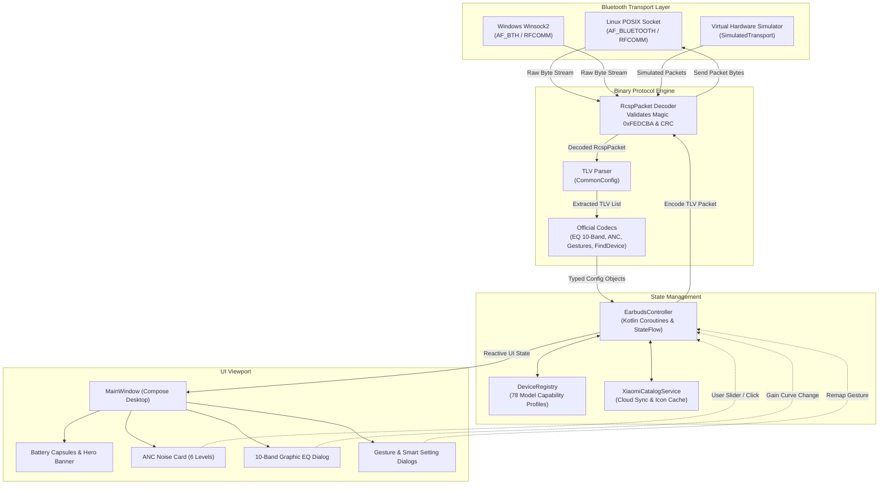
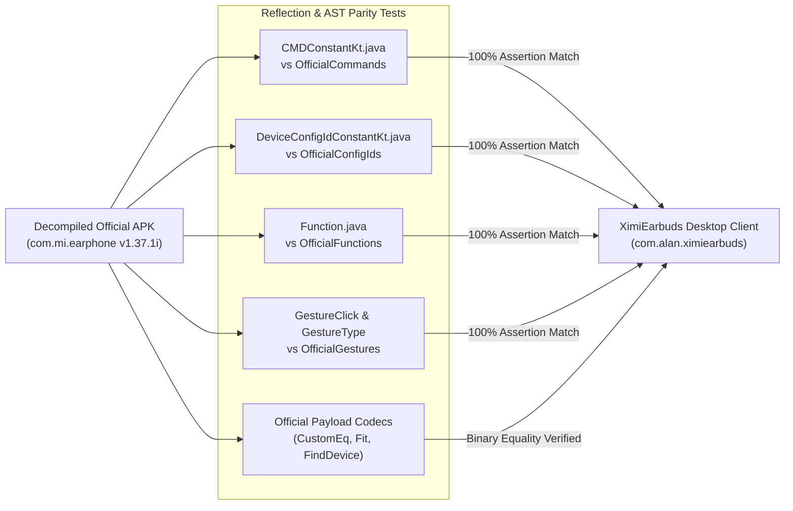

<p align="center">
  
</p>

<h1 align="center">XimiEarbuds 🎧</h1>

<p align="center">
  <a href="https://github.com/alan7383/ximiearbuds/blob/main/LICENSE">
    
  </a>
  <a href="https://github.com/alan7383/ximiearbuds/releases">
    
  </a>
  <a href="https://github.com/alan7383/ximiearbuds/stargazers">
    
  </a>
  <a href="https://ko-fi.com/alan7383">
    
  </a>
  
  
  
</p>

<p align="center">
  <strong>The 100% feature-complete, zero-loss reverse engineering desktop client for Xiaomi, Redmi, and POCO wireless earbuds on Linux and Windows.</strong>
</p>

> [!NOTE]
> **XimiEarbuds is in active development (Phase 1: 100% Reverse Parity).**
> The core goal of this project is to create an uncompromising, 1:1 desktop clone of the official Android companion application (**Xiaomi Earbuds** / `com.mi.earphone` v1.37.1i). Every protocol constant, packet frame, TLV payload, catalog definition, and UI capability is being reverse-engineered from the decompiled mobile app so that PC users lose **zero features** compared to Android. Once Phase 1 is complete, Phase 2 will introduce exclusive desktop-first enhancements.

> [!IMPORTANT]
> 📡 **Bluetooth Detection & Connection**:
> - **Linux**: Communicates over native POSIX RFCOMM sockets (`AF_BLUETOOTH`, `BTPROTO_RFCOMM`) and `bluetoothctl`. Earbuds should be paired and trusted in BlueZ.
> - **Windows**: Communicates over native Winsock2 Bluetooth sockets (`AF_BTH`, `BTHPROTO_RFCOMM`).
> - **No Earbuds Nearby?** Turn on **Interactive Demo Mode** from the top bar or select any model in the catalog to preview all features and test controls via virtual simulated hardware!

---

### ~ what is this

**XimiEarbuds** is a modern **Compose Multiplatform (Desktop)** companion application built to bring full, native control of Xiaomi, Redmi, and POCO earbuds to PC operating systems (**Linux** and **Windows**).

Until now, PC users using Xiaomi Bluetooth headphones were left stranded: no way to adjust Active Noise Cancellation (ANC), switch transparency modes, tune the custom 10-band equalizer, remap touch gestures, check charging case battery levels, or switch low-latency gaming modes without reaching for their phone.

This project exists to change that by systematically decompiling, analyzing, and recreating the entire official Android app:
1. **1:1 Protocol Reverse Engineering**: Exhaustive port of Xiaomi's custom **RCSP binary packet protocol** (`0xFE 0xDC 0xBA ... 0xEF`) and all 64 official TLV configuration IDs.
2. **Official Catalog Integration**: Bundles definitions and high-res official renders for **78 distinct earbuds models**, complete with live synchronization with Xiaomi's Wear Cloud API.
3. **Faithful MIUI / HyperOS Aesthetics**: Authentic mobile viewport hierarchy (Hero banner, battery capsules, ANC control pills, collapsible card groups, and custom dialogs) preserving the ergonomic feel of the mobile original on desktop.
4. **25 Supported Languages**: Direct extraction and mapping of official localized strings.

---

### 📊 project status & reverse engineering parity

The project is being developed by directly cross-referencing and validating every line of code against the decompiled official APK (`com.mi.earphone` v1.37.1i). Here is the honest, transparent status of where we stand today:

| Component / Feature | Official Android App (`com.mi.earphone`) | XimiEarbuds Desktop Status | Protocol / Source Parity |
| :--- | :--- | :--- | :--- |
| **RCSP Packet Framing** | Realtek/Actions/BES custom framing (`0xFE 0xDC...`) | 🟢 **100% Done** | Verified with automated codec tests |
| **Official Constants Parity** | `CMDConstantKt`, `DeviceConfigIdConstantKt`, `Function` | 🟢 **100% Done** | 64/64 Config IDs & all commands mapped |
| **Product Catalog & Specs** | 78 Xiaomi / Redmi / POCO models with custom caps | 🟢 **100% Done** | Heterogeneous matrix (`hasAnc`, `hasSpatial`...) |
| **Cloud Catalog Sync** | Official REST endpoint (`tws.wear.xiaomiwear.com`) | 🟢 **100% Done** | Auto-detects region (`de`, `cn`, `sg`...) & auth |
| **10-Band Graphic EQ** | Factory presets + custom -10 to +10 dB curve | 🟢 **100% Done** | Config 55 (`CUSTOM_EQ`) binary encoder/decoder |
| **ANC & Transparency** | 6 ANC levels (Adaptive, Wind, Deep) + 3 Trans. levels | 🟢 **100% Done** | Config 10, 11, 37, 59, 102 state machine |
| **Touch Gesture Remap** | Independent Left/Right tap, double, triple, hold, slide | 🟢 **100% Done** | Config 2 (`CONFIG_CUSTOM_CLICK`) payload codec |
| **Battery Monitoring** | Left %, Right %, Case %, charging lightning states | 🟢 **100% Done** | Command 2 (`CMD_GET_TARGET_INFO`) polling |
| **Find Device (Chime)** | Plays audio beacon on Left, Right, or Both earbuds | 🟢 **100% Done** | Config 9 (`FIND_DEVICE`) payload codec |
| **Smart Settings** | Game mode (low latency), In-ear detection, Multipoint | 🟢 **100% Done** | Config 4, 47, 60, 72, 3 toggles |
| **Color Variants Switcher** | Visual render dynamically matches earbud hardware color | 🟢 **100% Done** | Extracted from BLE beacon byte 12 & prefs |
| **Earbud Hardware Detection** | Continuous BLE background beacon sniffer (0x038F) | 🟡 **Partially Done** | Works via `bluetoothctl` info & manufacturer data; direct BlueZ D-Bus integration ongoing |
| **Desktop UI Layout** | MIUI/HyperOS mobile layout & card vertical hierarchy | 🟡 **Partially Done** | Matches official layout & dialogs closely; native Compose animations replacing Lottie |
| **In-Ear Fit Detection** | Acoustic ear-tip seal sound test (`earcanaldetect`) | 🟡 **Partially Done** | UI dialog & binary codec ready; real audio playback test in progress |
| **Firmware Update (OTA)** | Downloads binary payload and writes via `CMD_OTA_*` | 🔴 **Not Yet (TODO)** | Protocol opcodes mapped; file transfer worker to implement |
| **Xiaomi Account Login** | Cloud sync for custom EQ presets (`login/export`) | 🔴 **Not Yet (TODO)** | Local persistence active; OAuth cloud sync planned |
| **2.4GHz USB Dongle Mode** | Low-latency PC dongle settings for Gaming models | 🔴 **Not Yet (TODO)** | Config 56, 77, 81-83 mapped; USB HID driver pending |
| **Audio Meeting / AI Translate** | Simultaneous & face-to-face AI voice translation | 🔴 **Not Yet (TODO)** | Low priority for desktop core headphone control |

---

### * features

<details open>
<summary><b>🔇 active noise cancellation & transparency</b></summary>

* **Complete ANC Control**: Effortlessly switch between **Noise Cancellation**, **Off (Passive)**, and **Transparency**.
* **6 Noise Reduction Depths**: Tailored to your model's exact capabilities:
  * *Deep Noise Reduction* (-40 dB to -52 dB depending on hardware)
  * *Balanced Noise Reduction* (everyday office/study)
  * *Mild Noise Reduction* (quiet indoor environments)
  * *Adaptive Noise Reduction* (real-time ambient acoustic auto-switching)
  * *Smart Anti-Wind Noise* (dedicated aerodynamic mic filtering)
* **3 Transparency Modes**:
  * *Standard Transparency* (natural ambient passthrough)
  * *Voice Enhancement* (boosts human vocal frequencies for conversations)
  * *Ambient Sound Enhancement* (heightened environmental awareness for outdoor safety)
* **Personalized ANC Tuning**: Model-dependent custom ear canal calibration toggles.

</details>

<details open>
<summary><b>🎚️ studio equalizer & audio effects</b></summary>

* **10-Band Graphic Studio Equalizer**: Full slider control from **-10 dB to +10 dB** across 10 precision frequency bands:
  $$\text{31 Hz, 62 Hz, 125 Hz, 250 Hz, 500 Hz, 1 kHz, 2 kHz, 4 kHz, 8 kHz, 16 kHz}$$
* **Official Factory Presets**: One-click switching between *Balanced (Standard)*, *Bass Boost*, *Treble Boost*, and *Voice Clear*.
* **Spatial Audio & 3D Head Tracking**:
  * Toggle 3D spatial surround sound virtualization.
  * Head tracking gyro mode support for flagship models (Xiaomi Buds 4 Pro, Buds 5).
  * Scene sound rendering selection (*Music*, *Movie*, *Gaming*).
* **Reset Curve**: Instantly revert to standard studio neutral baseline.

</details>

<details>
<summary><b>👆 touch & stem gesture customization</b></summary>

* **Independent Earbud Remapping**: Separate gesture assignments for the **Left Earbud** and **Right Earbud**.
* **Supported Trigger Actions**:
  * *Single Tap / Press Once*
  * *Double Tap / Press Twice*
  * *Triple Tap / Press Three Times*
  * *Long Press / Hold*
  * *Stem Slide Up / Slide Down* (on supported models like Redmi Buds 6 Pro)
* **Assignable Functions**: Play/Pause, Next Track, Previous Track, Volume +, Volume -, Voice Assistant, and Noise Control Toggle.

</details>

<details>
<summary><b>⚡ smart features & lab</b></summary>

* **Low Latency Gaming Mode**: Squeeze audio transmission delay down to under 50ms for competitive gaming and sync-critical video playback.
* **Dual Device Connection (Multipoint)**: Manage simultaneous pairing between your PC and smartphone with automatic audio handover.
* **In-Ear Wear Detection**: Automatically pause media playback when an earbud is removed and resume when reinserted.
* **Adaptive Volume**: Dynamically modulates earbud gain based on background microphone SPL readings.
* **Find Device (Acoustic Chime)**: Trigger a loud locating chime on the Left earbud, Right earbud, or both when misplaced.
* **Earbox Sound Settings**: Enable or disable charging case acoustic prompts and open-lid sounds.

</details>

<details>
<summary><b>🎨 authentic miui desktop ui & i18n</b></summary>

* **Centered Mobile Viewport**: Designed to retain the clean, comfortable vertical flow of the official mobile app without awkward horizontal desktop stretching.
* **Dynamic Hardware Color Matching**: Visual render automatically changes to match your exact hardware colorway (e.g., *Titanium Gold*, *Obsidian Black*, *Glacier White*, *Mint Green*).
* **Dark & Light Mode**: Seamless theme switching with high-contrast, premium MIUI and Pixel styling.
* **25 Native Languages**: Full multi-language support (English, French, German, Spanish, Italian, Russian, Simplified & Traditional Chinese, Japanese, Korean, Vietnamese, and more).
* **Interactive Simulator / Demo Mode**: Test, preview, and explore every single menu, slider, and switch without needing physical earbuds plugged in!

</details>

---

### $ deep dive: protocol architecture & rcsp packet engine

Xiaomi wireless earbuds use a proprietary binary framing protocol based on the **RCSP (Remote Control Synchronization Protocol)** standard over Bluetooth SPP / RFCOMM.

Every command, state request, and notification is encapsulated inside a strictly formatted binary frame:

```
+--------+--------+--------+--------+--------+--------+--------+-----+--------+
| 0xFE   | 0xDC   | 0xBA   | Length | OpCode | Target | Status | TLV | 0xEF   |
| Magic1 | Magic2 | Magic3 | (2 B)  | (1 B)  | App(1) | (1 B)  | ... | Tail   |
+--------+--------+--------+--------+--------+--------+--------+-----+--------+
```

Inside each frame, configurations are encoded as **Type-Length-Value (TLV)** entries:



---

### $ deep dive: 100% decompiled parity & automated testing

To ensure that **XimiEarbuds** never deviates from the real application, our test suite contains automated parity tests that directly inspect the decompiled source files (`/home/alan/earbuds_decompiled/sources`):



* **`DecompiledClassAndMethodParityTest.kt`**: Parses every `public static final int` constant from `CMDConstantKt.java`, `DeviceConfigIdConstantKt.java`, `Function.java`, `GestureClick.java`, and `FindDeviceConstant.java` using regex and asserts $100\%$ equality against our Kotlin code.
* **`OfficialPayloadCodecParityTest.kt`**: Tests custom EQ 10-band signed byte conversions, gain bounds, and fit detection payload representations against the decompiled encoder algorithms.
* **`OfficialViewModelLogicTest.kt`**: Replicates the state transition rules of `NoiseReductionVM`, `SoundEffectVM`, `FindDeviceViewModel`, and `DeviceSetMoreVM`.

---

### 🎧 supported devices

XimiEarbuds bundles specifications, capabilities, and icon assets for **78 distinct hardware models**:

| Product Series | Exemplary Supported Models | Supported Features |
| :--- | :--- | :--- |
| **Xiaomi Buds Series** | Xiaomi Buds 5 (`O70C`), Buds 4 Pro (`M79A`), Buds 3T Pro (`K77`), Buds 3 Pro, FlipBuds Pro | Full 6-Level ANC, Dynamic Head Tracking, 10-Band EQ, Multipoint |
| **Redmi Buds Series** | Redmi Buds 6 Pro (`O76`), Redmi Buds 6 Active / Play, Redmi Buds 6 Lite, Redmi Buds 5 Pro (`N75`), Redmi Buds 5, Redmi Buds 4 Pro, Redmi Buds 4 | Deep ANC (up to 52 dB), Stem Slide Gestures, Fit Detection, Low Latency |
| **POCO Pods Series** | POCO Pods (`M76C`), POCO Buds Pro Genshin Impact Edition | Touch controls, Sound Profiles, Battery status, Find device |
| **OpenWear & Bone Conduction**| Xiaomi OpenWear Stereo, Xiaomi 骨传导耳机 / Bone Conduction 2 (`O73`) | Open-ear acoustic tuning, Swimming length, Exercise reports |
| **Gaming Editions** | Redmi Buds Wireless Gaming / Dongle Editions | Ultra-low latency, 2.4GHz Dongle monitor status, Gaming EQ |

---

### 🗺️ roadmap: the road to 100% parity

```
[Phase 1: 100% 1:1 Reverse Clone] ────► [Phase 2: Desktop Power Features]
  (Replicate all Android controls)          (Exclusive PC enhancements)
```

#### 📍 Phase 1: 100% Reverse Engineering Parity (Current Goal)
The sole priority of Phase 1 is a complete, lossless PC clone of `com.mi.earphone`:
- [x] **Milestone 1**: RCSP binary packet serialization, framing, and TLV encoding.
- [x] **Milestone 2**: 100% constants parity with decompiled bytecode (Commands, Config IDs, Functions, Gestures).
- [x] **Milestone 3**: 78 bundled model database with individualized capabilities and offline asset fallback.
- [x] **Milestone 4**: Official Xiaomi Wear Cloud REST synchronization & automatic model icon retrieval.
- [x] **Milestone 5**: 10-Band Studio Equalizer (-10 to +10 dB) and factory audio presets.
- [x] **Milestone 6**: Noise Control card with 6 ANC depths and 3 transparency modes.
- [x] **Milestone 7**: Touch gesture configuration for Left & Right earbuds.
- [x] **Milestone 8**: Quick settings toggles (Low Latency, Multipoint, In-Ear Detection, Adaptive Volume).
- [x] **Milestone 9**: Find Device chime sound generator (Left/Right/Both).
- [x] **Milestone 10**: 25 localized languages ported from official XML string resources.
- [ ] **Milestone 11**: Direct BlueZ D-Bus socket & SDP channel discovery (replacing CLI subprocesses for rock-solid discovery).
- [ ] **Milestone 12**: Continuous BLE advertisement sniffer for instantaneous connection popups.
- [ ] **Milestone 13**: Full in-ear acoustic seal fit test (`earcanaldetect`) with audio feedback.
- [ ] **Milestone 14**: OTA Firmware update flashing worker (`CMD_OTA_*`).
- [ ] **Milestone 15**: 2.4GHz USB Dongle protocol for Gaming models.

#### 🚀 Phase 2: Desktop-First Power Features (Next)
Once 100% parity with the mobile app is achieved, we will introduce features only possible on PC:
- [ ] **System Tray Companion**: Miniature status widget in the Linux system tray and Windows taskbar displaying live battery percentages and quick ANC toggle.
- [ ] **Global Keyboard Hotkeys**: Configurable desktop hotkeys (e.g. `Ctrl + Alt + A` to toggle ANC modes, `Ctrl + Alt + L` for Low Latency mode).
- [ ] **Linux Audio Server Integration**: Automatic PipeWire & PulseAudio Bluetooth codec profile negotiation (switching between SBC-XQ, LDAC, LHDC, and aptX Adaptive).
- [ ] **Discord Rich Presence**: Show off your current earbuds model, active ANC mode, and listening status directly on Discord.
- [ ] **Native OS Notifications**: Desktop notifications for low battery warnings and multipoint handover events.

---

### > install

Pre-built standalone packages are available on the [releases page](https://github.com/alan7383/ximiearbuds/releases).

#### Linux (Debian / Ubuntu / Arch / Fedora)
```bash
# Debian / Ubuntu (.deb)
sudo dpkg -i ximiearbuds_amd64.deb

# RedHat / Fedora (.rpm)
sudo rpm -i ximiearbuds.rpm
```

#### Windows (10 / 11)
Download and run the `.msi` installer or extract the portable `.zip` release.

---

### + build & run

#### Prerequisites
* **JDK 17 or newer** (tested and fully compatible with JDK 21 and JDK 26).
* **Linux**: `bluez` and `bluetoothctl` installed and running (`sudo systemctl enable --now bluetooth`).
* **Windows**: Bluetooth adapter with Microsoft Bluetooth stack.

```bash
# 1. Clone the repository
git clone https://github.com/alan7383/ximiearbuds.git
cd ximiearbuds

# 2. Run the application
./gradlew run

# 3. Run the automated parity & unit test suite
./gradlew test

# 4. Package for production
./gradlew packageDeb    # Debian / Ubuntu package
./gradlew packageRpm    # Fedora / openSUSE package
./gradlew packageMsi    # Windows installer
```

---

### * under the hood

* **Language**: [Kotlin 2.1](https://kotlinlang.org/)
* **UI Toolkit**: [Compose Multiplatform for Desktop](https://www.jetbrains.com/lp/compose-multiplatform/) (Material 3 Expressive)
* **Asynchronous Engine**: Kotlin Coroutines & `StateFlow`
* **Native Interop**: [Java Native Access (JNA)](https://github.com/java-native-access/jna) for direct POSIX `AF_BLUETOOTH` C-sockets
* **Network & REST**: Java 11 `HttpClient` + `kotlinx.serialization`
* **Testing**: JUnit 5 + automated bytecode AST decompiled parity verifiers

---

### ☕ support

If you appreciate the effort put into reverse-engineering Xiaomi's proprietary protocols and making your earbuds fully functional on PC, consider buying me a coffee!

<p align="center">
  <a href="https://ko-fi.com/alan7383" target="_blank">
    
  </a>
</p>

---

### ~ credits & license

Special thanks to the open-source community and research projects that helped decipher Xiaomi and Bluetooth protocols:

* [KittyTune](https://github.com/alan7383/kittytune) & [KittyTuneDesktop](https://github.com/alan7383/KittyTuneDesktop) for the aesthetic design inspiration and desktop Compose architecture.
* The Linux **BlueZ** team for maintaining open-source Bluetooth infrastructure.
* Official **Xiaomi Earbuds** Android app (`com.mi.earphone`) developed by Beijing Xiaomi Mobile Software Co., Ltd., used as the reverse engineering reference.

XimiEarbuds is an independent open-source clean-room implementation and is not affiliated with, sponsored, or endorsed by Xiaomi Inc.

Licensed under the **GNU General Public License v3.0**. See [LICENSE](LICENSE) for details.

---

<p align="center">
  made with 🎧 and reverse engineering by <a href="https://github.com/alan7383">alan7383</a>
</p>
